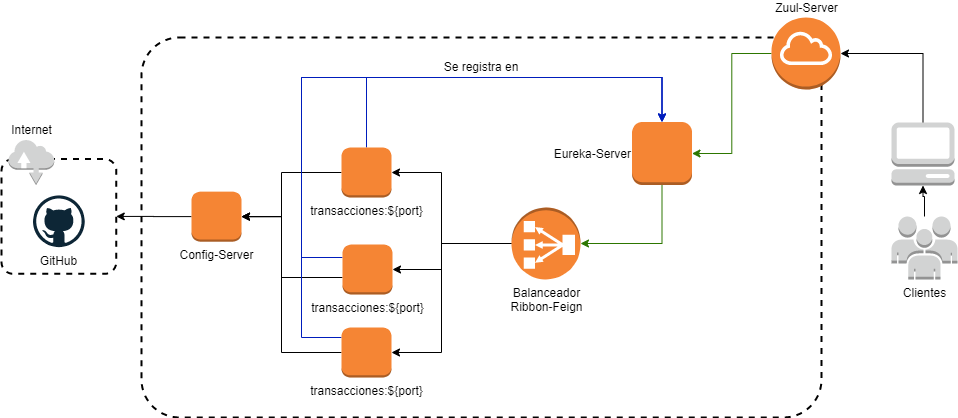

# Free-Bank
Es un banco 100% virtual, creado con las últimas tecnologías de desarrollo web, empleando microservicios, balanceo de cargas para ofrecer un ambiente de alta disponibilidad, configuración de propiedades centralizadas, entre otras funcionalidades.

# Arquitectura Empleada



# Pasos Para Ejecutar el Proyecto
Se debe seguir cada paso sin saltar el orden, de esta forma se podra compilar cada proyecto y al final tener todos los servicios ejecutandose de manera correcta.

## springboot-proporties
Se debe convertir la carpeta `springboot-proporties` en repositorio `GIT` con los siguientes comandos

```
git init
git add .
git commit -m "initial commit"
```
Este repositorio se encarga de conterner toda la configuraciónes de los `properties` que no deben ser expuestos, pero deben ser utilizados como es la conexión a la base de datos y sus datos de acceso.

## springboot-servicio-config-server
Este proyecto se encarga de consultar las configuración almacenadas en el repositorio `springboot-proporties`.

1. abrir el archivo de nombre `~/src/main/resources/application.properties` ubicar el nombre `RUTA_COMPLETA` y reemplazarlo por la ruta donde se encuentra el repositorio un tu computadora o portatil, ejemplo:
```
spring.cloud.config.server.git.uri=file:///C:/Users/robin/Documents/workspace-sts/springboot-proporties
```

# Iniciar los Proyectos
Los proyectos se deben ejecutar de forma secuencial, debido a que hay proyectos que son necesarios que este en ejecución antes de iniciar todos los proyectos.

1. `springboot-servicio-config-server` se debe ejecutar primero debido a que es el encargado de tener las propiedades disponibles.

2. `springboot-servicio-eureka-server` este proyecto es el encargado de recibir a los demas servicios para exponer la ruta entre ellos.

3. `springboot-servicio-transacciones` proyecto con todas las funcionalidades solicitadas para la prueba.

4. `springboot-servicio-zuul-server` proyecto al cual accede el cliente, este proyecto realiza la conexión con el proyecto `springboot-servicio-transacciones`

# H2 Database
Se utiliza `H2` como base de datos embebida, a la cual se puede acceder desde el siguiente link [Test database](http://localhost:8081/h2-console/). <br>
los parametros para acceder son:
```
 Driver class : org.h2.Driver
 JDBC URL: jdbc:h2:mem:testdb
 User name : sa
 password :
```
Al iniciar el proyecto se crean transacciones de ejemplo, las cuales puenden ser consultadas con las siguientes querys.

```sql
SELECT * FROM ACCOUNTS ;
SELECT * FROM TRANSACTIONS ;
```

# Pruebas con postman
Para realizar las pruebas en el aplicativo `Postman` se crea una collección la cual queda en la ubicación `~/Documents/Free-bank.postman_collection.json`, esta colleción se debe importar a `Postman`, una vez en `Postman` se podra visualizar la carpeta de nombre `Free-bank` con los metodos de consulta:
```
GET - getAll
GET - get by reference
GET - get by account iban
POST - Create
```
Esta collección ya cuenta con variables pre defininadas para hacer las pruebas.


# Mejoras
1. Implementar seguridad con `Spring Security`.
2. Crear un ambiente automatizado con `GIT`, `Jenkins` y `Docker`
3. Creación de los archivos `Dockerfile` y `Docker-compose` que permitan crear las imagenes y lanzar los contenedores en `Docker`


# Deuda Técnica
Implementación de las pruebas unitarias, se requiere más tiempo.